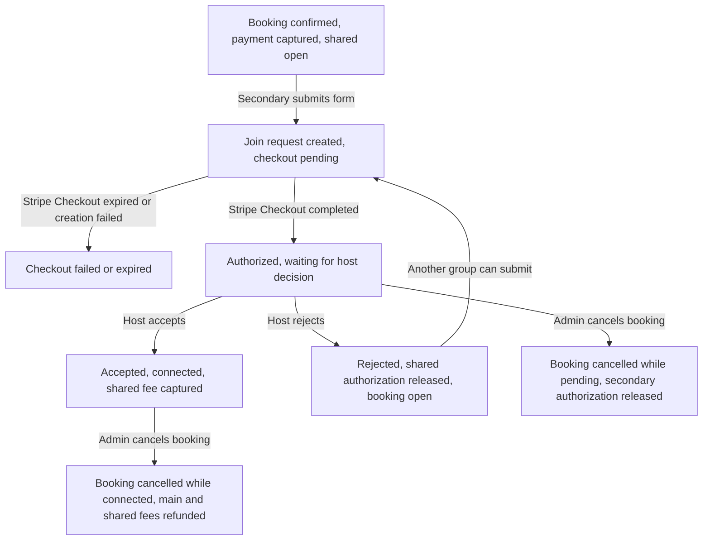

# Shared Boat Edge-Case Test Strategy

Use this document whenever changing the shared boat flow. The goal is to test the state transitions, not just individual pages.

Shared boat has four ledgers that must stay consistent:

- Main booking ledger: `bookings.booking_status`, `bookings.payment_status`, `bookings.shared_status`.
- Join request ledger: `shared_join_requests.status`, `shared_join_requests.payment_status`.
- Stripe ledger: the main booking PaymentIntent and the shared join PaymentIntent.
- Notification/link ledger: host manage link, guest manage link, public shared link, and emails.

If a scenario leaves any ledger inconsistent, treat it as a bug even if the page looks correct.

## Core Invariants

- A booking is joinable only when `bookings.is_shared_open = true`, `booking_status = confirmed`, `payment_status = captured`, and `shared_status = open`.
- No booking should have more than one active join request. Active means `shared_join_requests.status` is one of `authorized_pending_host_decision`, `sent_to_main_booker`, `accepted`, or `connected`.
- `bookings.shared_status = active_request` requires exactly one join request with `status = authorized_pending_host_decision` and `payment_status = authorized`.
- `bookings.shared_status = connected` requires exactly one join request with `status = accepted` and `payment_status = captured`.
- `shared_join_requests.status = accepted` requires `payment_status = captured` and a stored `stripe_payment_intent_id`.
- `shared_join_requests.status = rejected` requires `payment_status = released`.
- `shared_join_requests.payment_status = refunded` means the main shared booking was cancelled after the secondary fee was captured.
- `released`, `rejected`, `failed`, and `refunded` join requests must not block new requests.
- Admin cancelling a connected shared booking must settle both money flows: refund the main booking fee and refund the accepted shared join fee.
- Admin cancelling while a join request is still pending host decision must refund or release the main booking fee, then release the secondary authorization.
- Guest manage links require `shared_join_requests.customer_manage_token`; old rows without that token are not valid for the new secondary manage page.
- Public shared links must never expose private host or guest contact details.

## State Machine



## Edge-Case Matrix

Each row should be tested after any change that touches `src/app/api/shared-join-requests/route.js`, `src/lib/stripe/sharedJoinRequests.js`, host manage actions, admin cancellation, shared pages, promo pricing, or email copy.

| ID | Setup | Action | Expected database state | Expected Stripe state | Expected user-facing result |
| --- | --- | --- | --- | --- | --- |
| S01 happy path | Main booking is `confirmed/captured/open`; no active request | Secondary submits valid form and completes Checkout; host accepts | Booking becomes `shared_status = connected`; request becomes `status = accepted`, `payment_status = captured` | Shared PaymentIntent captured | Host and guest manage pages show contact exchange; guest and host acceptance emails sent |
| S02 host reject | Request is `authorized_pending_host_decision/authorized` | Host rejects from main manage page | Booking returns to `shared_status = open`; request becomes `status = rejected`, `payment_status = released` | Shared PaymentIntent canceled | Guest sees not accepted/released; another group can submit |
| S03 checkout cancelled | Request row exists with `authorization_pending` | User exits Stripe Checkout via cancel URL | Request remains non-active until expiration or retry; public page shows cancelled message | No capture; no active authorization | Public shared page says authorization was not completed |
| S04 checkout expired | Request is `authorization_pending/authorization_pending` | Stripe sends `checkout.session.expired` | Request becomes `status = failed`, `payment_status = failed` | No capture | Public shared link remains usable if booking is still open |
| S05 duplicate webhook | Request already became `authorized_pending_host_decision/authorized` | Same `checkout.session.completed` webhook arrives again | No duplicate state changes and no second active request | No second authorization or capture | No duplicate visible request |
| S06 success page before webhook | Stripe redirects guest to manage page before webhook is processed | Guest manage page calls shared checkout completion by `session_id` | Same as S01 pre-host state: request becomes pending host decision | Authorization recorded once | Guest sees waiting-for-host state |
| S07 race two groups | Two request rows are `authorization_pending`; both complete Checkout | Process both completed sessions | One request becomes `authorized_pending_host_decision/authorized`; other becomes `released/released` | Losing PaymentIntent canceled | Booking shows one pending request; losing guest is not connected |
| S08 stale public link | Booking is `shared_status = active_request`, `connected`, or `cancelled` | Secondary tries to submit a new request | API returns unavailable or active-request error; no new active request | No Checkout created | Public page blocks new submission |
| S09 capacity over limit | Main booking has 5 guests or `shared_open_seats = 1` | Secondary submits 2+ guests | API rejects with invalid guest count | No Checkout created | Form displays guest-count error |
| S10 gender mismatch | Main booking preference is `female_only` or `male_only` | Secondary submits incompatible composition | API rejects with gender preference mismatch | No Checkout created | Form displays preference mismatch |
| S11 cutoff closed | Tour starts within 48 hours in Capri time | Secondary submits form | API rejects cutoff closed | No Checkout created | Public page/form says requests are closed |
| S12 promo discount | Shared request uses a valid promo | Secondary submits and completes Checkout | Request stores original fee, promo code, discount, final fee | Checkout amount equals final fee with minimum EUR 1 | Guest and admin see discounted request fee |
| S13 invalid promo | Shared request uses inactive/invalid promo | Secondary submits | No request row should become active | No Checkout created | Form shows promo error |
| S14 missing contact | Preferred method is WeChat and WeChat value is empty | Secondary submits | No request row should become active | No Checkout created | Form shows required contact error |
| S15 accept double-click | Request is pending host decision | Host submits accept twice | First call captures and accepts; second call is idempotent/no-op | PaymentIntent captured only once | Page remains accepted; no duplicate charge |
| S16 reject double-click | Request is pending host decision | Host submits reject twice | First call releases and rejects; second call does not reopen invalid state | PaymentIntent canceled only once | Page remains rejected/released |
| S17 accept after reject | Request is already `rejected/released` | Host tries accept from stale page/action | Action fails safely | No capture | Host sees shared error |
| S18 reject after accept | Request is already `accepted/captured` | Host tries reject from stale page/action | Action fails safely | No cancel/refund unless admin cancellation path is used | Host sees shared error |
| S19 admin cancel open | Booking is shared open with no active request | Admin cancels confirmed booking | Booking becomes `cancelled/refunded/cancelled`; no request changes | Main PaymentIntent refunded | Main customer cancellation email sent; public shared link closed |
| S20 admin cancel pending | Booking has pending authorized join request | Admin cancels booking | Booking becomes cancelled/refunded/cancelled; request becomes `released/released` | Main PaymentIntent refunded; shared PaymentIntent canceled | Host and guest pages show closed/released states; guest cancellation email sent |
| S21 admin cancel connected | Booking is connected with accepted request | Admin cancels booking | Booking becomes cancelled/refunded/cancelled; request becomes `released/refunded` | Main PaymentIntent refunded; shared PaymentIntent refunded | Guest manage page shows refund started; cancellation email sent |
| S22 captain not available before confirmation | Main booking is checking with captain and authorized | Admin releases authorization as not available | Booking becomes `not_available/released`; shared stays pending/cancelled if applicable | Main authorization canceled | Customer gets not-available email |
| S23 manual refund only | Booking remains confirmed but admin manually refunds main payment | Admin clicks manual refund | Booking payment becomes `refunded`; shared request is unchanged | Main PaymentIntent refunded only | Admin must separately cancel if trip is not happening |
| S24 old request row | Request exists without `customer_manage_token` | Guest opens secondary manage URL or email cannot be built | Link is invalid; row should not be used for new flow | No Stripe action | Use fresh request for new testing |
| S25 permission/schema | New columns or grants missing | Submit/join/admin page loads | Errors are visible in server logs; no partial active request should survive | No capture unless DB update succeeds | Fix SQL patch/grants before retesting |

## Manual Stripe Test Pass

Run these with Stripe test mode, the local dev server, Stripe CLI forwarding webhooks, Supabase table view open, and a real inbox or Resend dashboard.

Useful Stripe test cards:

- Success: `4242 4242 4242 4242`.
- 3D Secure challenge: `4000 0025 0000 3155`.
- Decline: `4000 0000 0000 9995`.

Before each pass:

- [ ] Apply the latest SQL patches, especially `supabase/shared-join-requests.sql`.
- [ ] Confirm `service_role` can `select`, `insert`, and `update` `public.shared_join_requests`.
- [ ] Confirm `.env.local` has Stripe, Supabase, Resend, and `NEXT_PUBLIC_SITE_URL` values for the environment being tested.
- [ ] Start the app with `npm run dev`.
- [ ] Start Stripe webhook forwarding for `/api/stripe/webhook`.
- [ ] Use a main booking date more than 48 hours in the future.

### Pass 1: Happy Path

- [ ] Create main booking with sharing enabled and a group smaller than 6.
- [ ] Complete main booking authorization and capture it from admin.
- [ ] Confirm booking row is `booking_status = confirmed`, `payment_status = captured`, `shared_status = open`.
- [ ] Open the public shared link and submit a secondary join request.
- [ ] Complete secondary Checkout.
- [ ] Confirm `shared_join_requests` row becomes `status = authorized_pending_host_decision`, `payment_status = authorized`.
- [ ] Confirm booking row becomes `shared_status = active_request`.
- [ ] Confirm host receives review email and guest receives under-review email.
- [ ] Accept from host manage page.
- [ ] Confirm shared PaymentIntent is `succeeded` in Stripe.
- [ ] Confirm request becomes `status = accepted`, `payment_status = captured`.
- [ ] Confirm booking becomes `shared_status = connected`.
- [ ] Confirm host and guest receive accepted emails.
- [ ] Confirm host manage page shows guest contact.
- [ ] Confirm guest manage page shows host contact and tour logistics.

### Pass 2: Reject and Reopen

- [ ] Start from a confirmed shared booking with `shared_status = open`.
- [ ] Submit and authorize a secondary request.
- [ ] Reject from host manage page.
- [ ] Confirm shared PaymentIntent is canceled.
- [ ] Confirm request is `status = rejected`, `payment_status = released`.
- [ ] Confirm booking returns to `shared_status = open`.
- [ ] Confirm guest rejected email is sent.
- [ ] Submit a new secondary request and confirm Checkout can open.

### Pass 3: Race Condition

- [ ] Open the public shared page in two browsers or profiles.
- [ ] Submit two different secondary requests close together.
- [ ] Complete both Stripe Checkouts.
- [ ] Confirm only one request becomes `authorized_pending_host_decision/authorized`.
- [ ] Confirm the losing request becomes `released/released`.
- [ ] Confirm the losing PaymentIntent is canceled in Stripe.
- [ ] Confirm booking has only one active request.

### Pass 4: Admin Cancel While Pending

- [ ] Create a pending authorized join request.
- [ ] Cancel the main booking from admin.
- [ ] Confirm main PaymentIntent is refunded if captured, or released if only authorized.
- [ ] Confirm shared join PaymentIntent is canceled.
- [ ] Confirm booking is `booking_status = cancelled`, `shared_status = cancelled`.
- [ ] Confirm request is `status = released`, `payment_status = released`.
- [ ] Confirm guest manage page shows released/not charged.
- [ ] Confirm cancellation email is sent to the guest.

### Pass 5: Admin Cancel While Connected

- [ ] Complete happy path through host acceptance.
- [ ] Cancel the main booking from admin.
- [ ] Confirm main PaymentIntent refund is created.
- [ ] Confirm shared join PaymentIntent refund is created.
- [ ] Confirm booking is `booking_status = cancelled`, `payment_status = refunded`, `shared_status = cancelled`.
- [ ] Confirm request is `status = released`, `payment_status = refunded`.
- [ ] Confirm guest manage page shows refund started.
- [ ] Confirm cancellation/refund email is sent to the guest.

### Pass 6: Expired Checkout

- [ ] Submit a secondary request but do not complete Stripe Checkout.
- [ ] Wait for or trigger `checkout.session.expired`.
- [ ] Confirm request becomes `status = failed`, `payment_status = failed`.
- [ ] Confirm booking remains `shared_status = open` if no active request exists.
- [ ] Confirm public shared link can accept a fresh request.

### Pass 7: Link and Privacy States

- [ ] Public shared page while open: shows tour details and join form, no private host contact.
- [ ] Public shared page while active request exists: says request is pending/unavailable.
- [ ] Public shared page after connected: closed, no private contacts.
- [ ] Public shared page after booking cancelled: closed.
- [ ] Host manage page while pending: shows guest request and accept/reject buttons.
- [ ] Host manage page after accepted: shows guest contact but no accept/reject buttons.
- [ ] Guest manage page while pending: no host contact.
- [ ] Guest manage page after accepted: host contact and logistics visible.
- [ ] Guest manage page after rejected/released/refunded: no host contact.
- [ ] Wrong token for either manage page: invalid/expired link message.

## Database Probes

Use these after each manual pass.

```sql
select
  id,
  booking_status,
  payment_status,
  is_shared_open,
  shared_status,
  shared_open_seats,
  shared_gender_preference,
  stripe_payment_intent_id
from public.bookings
where id = '<booking_id>';
```

```sql
select
  id,
  booking_id,
  status,
  payment_status,
  guest_count,
  customer_manage_token is not null as has_manage_token,
  stripe_checkout_session_id,
  stripe_payment_intent_id,
  authorized_at,
  accepted_at,
  rejected_at,
  contact_shared_at,
  updated_at
from public.shared_join_requests
where booking_id = '<booking_id>'
order by created_at desc;
```

```sql
select
  booking_id,
  count(*) filter (
    where status in (
      'authorized_pending_host_decision',
      'sent_to_main_booker',
      'accepted',
      'connected'
    )
  ) as active_request_count
from public.shared_join_requests
where booking_id = '<booking_id>'
group by booking_id;
```

## Automation Scope

The project currently has lint/build scripts but no test runner. If we automate, add tests in this order:

1. Pure helper tests for `src/lib/sharedBoat.js`.
   - `isValidSharedBookingForJoin`
   - `getSharedJoinCapacity`
   - `isGenderCompositionAllowed`
   - cutoff behavior around the 48-hour Capri-time boundary

2. API validation tests for `src/app/api/shared-join-requests/route.js`.
   - invalid token
   - active request exists
   - capacity overflow
   - gender mismatch
   - promo minimum fee
   - missing required contact fields

3. Mocked Stripe/Supabase tests for `src/lib/stripe/sharedJoinRequests.js`.
   - completed session activates exactly one request
   - losing race releases authorization
   - accept captures and marks connected
   - reject cancels and reopens booking
   - admin cancellation releases pending join request
   - admin cancellation refunds accepted join request

4. Optional browser-level tests after the flow stabilizes.
   - public shared page form to Stripe redirect
   - host manage accept/reject controls
   - guest manage accepted/released/refunded display states

Recommended first automation step: add Vitest and write unit tests for `src/lib/sharedBoat.js`. Those tests are low risk, fast, and do not need Stripe, Supabase, or browser automation. Add integration tests only after the final shared status names are stable.

## Pre-Release Checklist

- [ ] Run `npm run lint`.
- [ ] Run `npm run build`.
- [ ] Complete manual passes 1, 2, 4, and 5 at minimum.
- [ ] Confirm Stripe dashboard has the expected capture/refund/cancel actions.
- [ ] Confirm no customer can see another group's private contact details.
- [ ] Confirm no failed/released/refunded request blocks a new request.
- [ ] Confirm all emails use the correct locale and include the right manage link.
